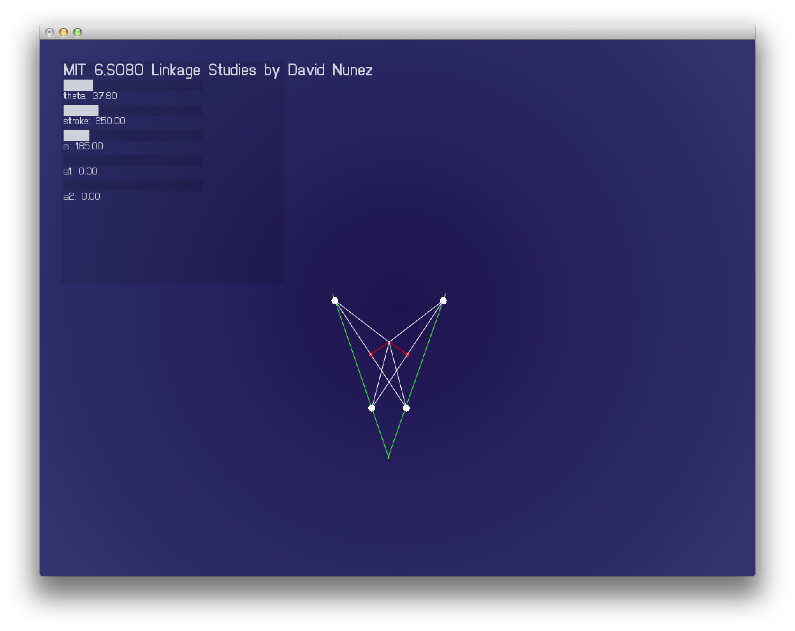
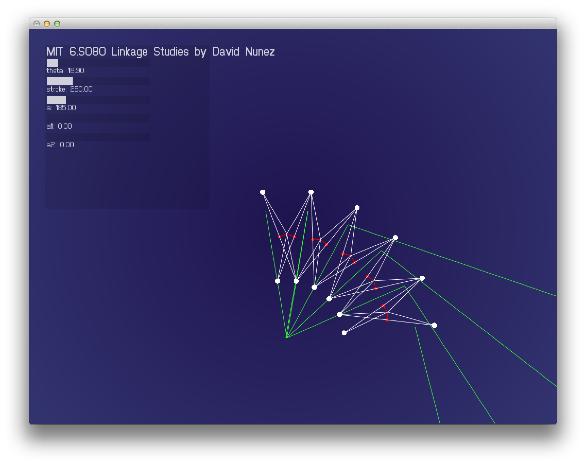
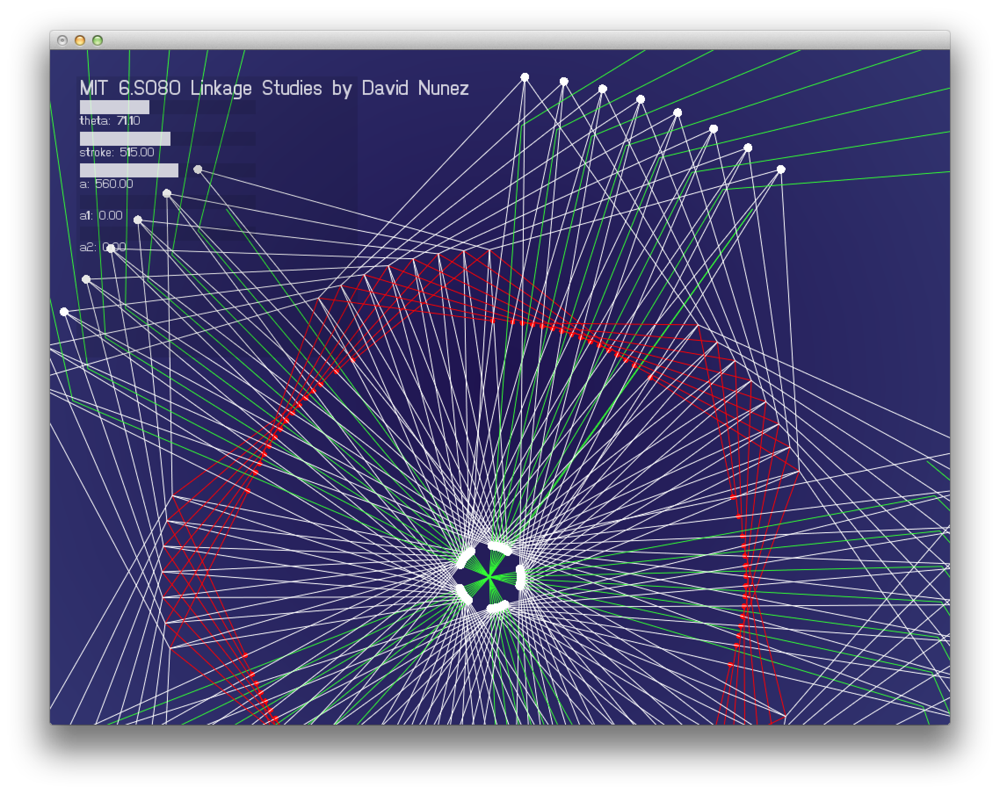

# MIT.6S080 assignment 1 writeup
## David Nunez

For Assignment 1, I created a sandbox tool and library for openFrameworks that allows designers to experiment with angular linkages. This will likely turn into an ongoing side project for the semester.

# Features

- slider for stroke changes length of movement
- slider for theta changes angle of linkage
- "a" value changes length of "virtual" linkage arm 
- "a1" and "a2" 
- sinusoidal animation
- ability to add and remove multiple linkages all radiating from central point 

## Questions to Explore

- allow for different "engines" to alter the application of force to the animation
- What happens when we curve the stroke?  	
- Can we design a mechanism that keeps the link moving in a straight line, but allow the curved stroke to inject interesting velocity profiles?
- How do we map points in the mechanism to see how their paths curve? 
- Detect nans and other impossible conditions
- Expand this into 3d
- Play with minimal "kinematic units" to create a "lego-like" design tool
	

